# 🚗 ML-Based Speed Prediction in SUMO  
Predicting and controlling vehicle speed in SUMO using a Machine Learning model

This project combines **SUMO** (Simulation of Urban Mobility) with **Machine Learning** to predict the speed of a vehicle based on leader–follower dynamics.  

1. automatically launches multiple SUMO simulations  
2. collects driving data (speed, distance and leader speed)  
3. trains an ML model and saves it  
4. evaluates the model (scatter plot + MAE)  

## 🎯 Project Goal

The goal is to develop a model that predicts the **next speed** of a vehicle.  
To achieve this, multiple SUMO runs are executed to generate a robust dataset.

The model learns from:

- current speed  
- distance to the leader  
- leader speed  

## Programs used 

- **SUMO**  
- **Python**  

# Python Libraries used: 
- scikit-learn
- NumPy
- Pandas  
- Matplotlib
- traci
- networkx 

# Program structure 

## Build Network 
- open web OSM wizard to get a SUMO network, download it with build in vehicles that are driving around the map 
- build a networkx graph object from that

## selecting route 
- select a random route with start and end edge

## Running simulation 10 times 
- Add a vehicle whose velocity will be predicted later by a ML 
- let the vehicle start from the start to the end edge 
 
- log data for training the Machine Learning Model:
    - speed of the vehicle
    - speed of a leading vehicle 
    - distance between vehicle and a leading vehicle 
 
- train a Machine Learning model

<video src="results/simulation.mp4" controls width="600"></video>

## Machine Learning

A **neural network** is used in order to determine the velocity of the vehicle for the next time step. 

### Inputs 
-  the velocity of the vehicle i for the current time steps and the previous 4 time steps 
-  the velocity of the leading vehicle j for the current time steps and the previous 4 time teps 
-  the distance s between the vehicle i and the leading vehicle j of the leading vehicle for the current time steps and the previous 4 time steps 

### Output
-  the velocity of the vehicle i for the next time step 

### structure of the neural network 
- index i: vehicle
- index j: leading vehicle 
- subscript t: time 

```mermaid
flowchart LR

    A["vᵢᵗ<br>vᵢᵗ⁻¹<br>vᵢᵗ⁻²<br>vᵢᵗ⁻³<br>vᵢᵗ⁻⁴"] --> B[neural network]

    D["sᵢⱼᵗ<br>sᵢⱼᵗ⁻¹<br>sᵢⱼᵗ⁻²<br>sᵢⱼᵗ⁻³<br>sᵢⱼᵗ⁻⁴"] --> B

    E["vⱼᵗ<br>vⱼᵗ⁻¹<br>vⱼᵗ⁻²<br>vⱼᵗ⁻³<br>vⱼᵗ⁻⁴"] --> B

    B --> F["vᵢᵗ⁺¹"]

    %% Farben mit gutem Kontrast
    style A fill:#e8f2ff,stroke:#4a90e2,stroke-width:2px,color:#000
    style D fill:#e8ffe8,stroke:#3fa34d,stroke-width:2px,color:#000
    style E fill:#fff2e0,stroke:#ff9900,stroke-width:2px,color:#000
    style B fill:#f7e6ff,stroke:#b84ae2,stroke-width:2px,color:#000
    style F fill:#fff9cc,stroke:#e2c14a,stroke-width:2px,color:#000



```

## Results of the simulation

- the result shows high r2 score and a low Mean Absolute Error